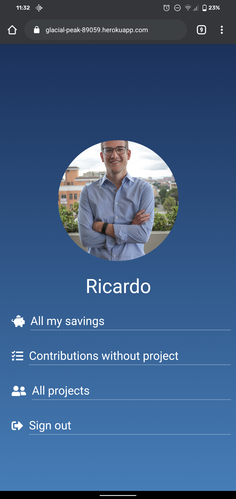

# Piggy App

A Ruby on Rails mobile web app that helps you organize with your friends / family around projects (i.e. trips, kickoff business ideas, fix household problems, etc.) and save enough money to implement such projects.

## Live Demo
[Live Demo Link](https://glacial-peak-89059.herokuapp.com/welcome)

## Video Demo
[Walkthrough Video Demo](https://www.loom.com/share/3825be9acc0d4c96b1faa0db56a592d1)

# App screenshots




## Built With
- Ruby v2.7.0
- Ruby on Rails v6.0.3.2

## Getting Started
- Fork the repository and create a local one on your computer
- Move to the repository inside the command line using `cd` and the path to the file
- Run `bundle install` and `rails db:migrate`
- Run `rails server` (in case you already have something running on port 3000 run `rails server -p 3001` where the number can be any port you want.)
- inside your browser go to http://localhost:3000/, changing the port number in case you chose a custom one
- explore the application

## Instructions
- Log in and add create your user
- Create a saving and add it to a specific project you want to contribute. In case you don't have any projects, create your first
- Go to your projects and checkout the contributions other's have provided to you

### Prerequisites

- Ruby: 2.7.0
- Rails: v6.0.3.2
- Postgres: >=9.5

### Setup
- Install gems
  `bundle install`
- Create DB
  `rails db:create`
- Setup database
  `rails db:migrate`

### Usage
- Run `rails server` and run the App on your local server

### Run tests
- We used Rspec and Capybara with Selenium Chrome Driver for user testing. 

If you want to run tests, please do the following:
1. Install the following gems on your Gemfile:
  - gem 'rspec-rails'
  - gem 'capybara'
  - gem 'webdrivers'

2. Run `rails g rspec::install` on your command line
3. Add the following into your spec/rails_helper.rb:
  - Capybara.default_driver = :selenium_chrome

4. Run `Rspec` on your command line and review the results.

### Deployment to Heroku
1. Create Heroku Application `heroku create`
2. Modify your gemfiles to deploy a Rails application. 
    
```
    group :development, :test do
    gem 'sqlite3'
    end

    group :production do
    gem 'pg'
    end
```

3. Bundle install `bundle install --without production`
4. Push to Heroku `git push heroku master`
5. Migrate the database on Heroku: `heroku run rails db:migrate`
6. Check the live application: `heroku open`

## Project Roadmap
- Implement adding friend requests and looking for friends personal savings
- Create a dashboard with the most contributing members of the community

## Authors
👤 Santiago Rodriguez
- Github: [@srba87](https://github.com/santiagorodriguezbermudez)
- Twitter: [@srba87](https://twitter.com/srba)
- Linkedin: [srba87](https://linkedin.com/in/srba87)

## Credits
Layouts design by [Gregoire Vella on Behance](https://www.behance.net/gregoirevella)<br>
Icons made by <a href="https://www.flaticon.com/authors/freepik" title="Freepik">Freepik</a> from <a href="https://www.flaticon.com/" title="Flaticon"> www.flaticon.com</a>

## 🤝 Contributing

Contributions, issues and feature requests are welcome!
Feel free to check the [issues page](issues/).

## Acknoledgements

Special thanks to my Microverse team, mentor and peers:
- Ocicats Team
- Michael Threels
- Daniel Santander

## Show your support

Give a ⭐️ if you like this project!
